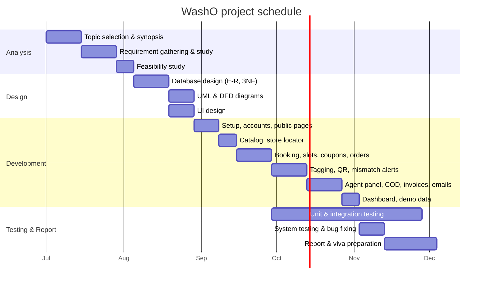

# Synopsis

**Savitribai Phule Pune University · T.Y. B.Sc. (Computer Science) · NEP 2020**

| | |
|---|---|
| **Project title** | **WashO: Online Laundry & Dry-Cleaning Service Platform with Garment-Level Tagging** |
| **Student** | _(Your name, roll number)_ |
| **Guide** | _(Guide's name)_ |
| **College** | _(College name, Pune)_ |
| **Academic year** | 2026–27 |
| **Platform** | Web application (desktop and mobile browsers) |
| **Technology** | Python 3.14, Django 5.2 LTS, PostgreSQL 18, Bootstrap 5, HTMX, Chart.js |

---

## 1. Abstract

WashO is a web application for a doorstep laundry and dry-cleaning business in Pune. A customer books
a pickup online: they choose services, give approximate item counts, pick a time slot and see an
instant price estimate. A delivery agent then collects the clothes. At the store, **every garment is
tagged individually** with its own code and QR label, and any stain or damage is recorded with a
photo before cleaning starts. The garment count is checked at **three points (pickup, store and
delivery)**, and any difference automatically raises an alert to the admin. The final bill is made
from the garments actually received. Payment is **Cash on Delivery** (cash or UPI to the agent), and
the customer receives a PDF invoice and email updates at every step. Four roles (Customer, Store
Staff, Delivery Agent, Admin) each get their own screens. An admin dashboard shows orders and revenue
using a PostgreSQL view, and a PL/pgSQL trigger keeps a complete audit trail of every status change.

## 2. Problem statement

Laundry is a regular household need, and many people in cities now prefer doorstep services. However:

- Customers have **no proof of what they handed over**. A bag of clothes is counted loosely or not at
  all, so when a shirt goes missing nobody can prove where. Missing garments are one of the most
  common complaints in public reviews of online laundry services.
- Existing small laundries keep orders in **paper registers**: no tracking, frequent billing mistakes
  and no record of stains that were already on the clothes.
- Pickups are often promised at times when no agent is free, because there is no **slot capacity**
  control.
- The owner cannot easily see **daily revenue, pending orders or problem orders**.

## 3. Objectives

1. Let customers book a pickup online with an instant, transparent price estimate.
2. Tag every garment individually (unique code + QR) and record stains or damage with photos.
3. Count garments at pickup, store and delivery, and raise an **automatic mismatch alert**.
4. Prevent overbooking with limited capacity per time slot per area.
5. Track every order through a clear lifecycle with a complete audit trail.
6. Support Cash on Delivery with proper payment records and PDF invoices.
7. Give each role (customer, staff, agent, admin) a simple screen built for its own work.
8. Give the admin a dashboard of orders, revenue and alerts.

## 4. Scope

**In scope:** public website (services, price list, store locator with pincode check, FAQ, contact);
customer registration with mobile number; address book; booking with coupons and express service;
pickup slots with capacity; order tracking with live status; staff panel with garment tagging, QR
labels and damage photos; delivery agent panel; three-point garment count with mismatch alerts;
Cash on Delivery; PDF invoices; email notifications; admin dashboard; Pune demo data.

**Out of scope (future work):** online payment gateway, complaints and reviews module, SMS/WhatsApp
alerts, native mobile app, route optimisation for agents.

## 5. Existing system and its limitations

| Existing system | Limitations |
|---|---|
| Local laundry with a paper register | No online booking or status; manual bills; no garment-level record; data lost if the register is lost |
| Phone or WhatsApp orders | Pickup time not guaranteed; no price estimate; no history |
| App-based laundry services | Convenient, but garments are usually counted per bag, not per piece, so missing-item disputes are hard to resolve; customers don't see the condition of each garment |

## 6. Proposed system

WashO keeps the convenience of an online service and adds **garment-level accountability**:

- **One record per garment**, with a tag code like `WO-000123-04`, a QR label, colour/brand, and a
  stain/damage note with photo, all visible to the customer.
- **Three counts per order.** A difference raises an alert, and the admin must write how it was resolved.
- **Slots with capacity**, protected by database row locking, so a slot can never be overbooked.
- **Final bill from tagged garments**, so the customer pays for what was actually received.
- **The database itself enforces key rules**: CHECK constraints (e.g. *total = subtotal + express −
  discount*), a PL/pgSQL trigger for the status history, and a view for the revenue report.

## 7. Modules

| # | Module | Main features |
|---|---|---|
| 1 | Public website | Home, services, price list (live search), store locator with pincode check, FAQ, contact form |
| 2 | Accounts & roles | Mobile-number login, 4 roles (Django Groups), address book limited to served areas |
| 3 | Service catalog | 6 categories, 35 items, per-item prices, express surcharge |
| 4 | Booking & orders | Live estimate, coupons, pickup slots with capacity, order lifecycle, status history trigger |
| 5 | Garment tagging (staff) | Receive order, tag each garment with QR, stain/damage + photo, print tags, final bill |
| 6 | Delivery (agent) | Today's pickups/deliveries, pickup count, delivery count, call & directions |
| 7 | Count checks & alerts | Pickup → store → delivery comparison, automatic alerts, email to admin, resolution |
| 8 | Payments & invoices | Cash on Delivery (cash/UPI), payment records, PDF invoice |
| 9 | Notifications | Email to customer on booking and every status change, invoice attached on delivery |
| 10 | Admin dashboard | KPIs, daily and monthly revenue (PostgreSQL view), orders by status, top services, stores |

## 8. Hardware and software requirements

**Hardware (development / server)**

| Component | Minimum | Recommended |
|---|---|---|
| Processor | Intel Core i3 / AMD Ryzen 3 | Core i5 / Ryzen 5 |
| RAM | 4 GB | 8 GB |
| Disk space | 2 GB free | 5 GB free (photos) |
| Client | Any device with a modern browser; smartphone with camera for agents/staff | |

**Software**

| Software | Version used |
|---|---|
| Operating system | Windows 10/11 (also runs on Linux/macOS) |
| Python | 3.14.3 (3.12+ supported) |
| Django (web framework) | 5.2.17 LTS |
| PostgreSQL (database) | 18.3 |
| psycopg (database driver) | 3.3.6 |
| Bootstrap / Bootstrap Icons | 5.3.8 / 1.13.1 |
| HTMX / Chart.js | 2.0.4 / 4.4.1 |
| ReportLab (PDF), qrcode, Pillow | 5.0.1, 8.2, 12.3.0 |
| python-decouple (settings) | 3.8 |
| Git, VS Code, Chrome/Edge | latest |

## 9. Project schedule (Gantt chart)

_Planned schedule. Adjust the dates to your college calendar before submitting._

## 10. Expected outcome

A working, mobile-friendly web application that a small laundry chain could use from day one. It
gives customers transparency down to each garment, gives the business control over slots and
payments, and gives the owner reliable reports, with the most important rules enforced by the
PostgreSQL database itself.
