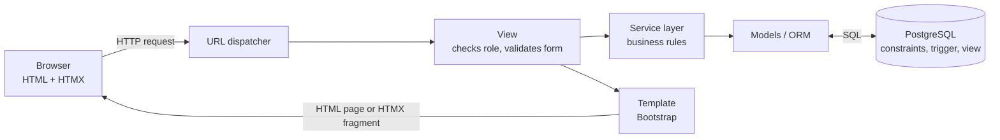

# WashO: Online Laundry & Dry-Cleaning Service Platform with Garment-Level Tagging

**Project report submitted in partial fulfilment of the requirements for the degree of
Bachelor of Science (Computer Science), Savitribai Phule Pune University (NEP 2020).**

_Student: (name, roll no.) · Guide: (name) · College: (name) · Academic year 2026–27_

> Put the college's certificate, declaration and acknowledgement pages in front of this text in the
> Word file. Diagrams are in `03_diagrams.md` (PNG copies in `diagrams/`). The data dictionary is
> `04_data_dictionary.md` and the test case table is `05_test_cases.md`.

---

## Table of contents

1. [Introduction](#chapter-1-introduction)
2. [Literature survey and study of the existing system](#chapter-2-literature-survey-and-study-of-the-existing-system)
3. [Requirement analysis](#chapter-3-requirement-analysis)
4. [Feasibility study](#chapter-4-feasibility-study)
5. [System design](#chapter-5-system-design)
6. [Implementation](#chapter-6-implementation)
7. [Testing](#chapter-7-testing)
8. [Limitations](#chapter-8-limitations)
9. [Future enhancements](#chapter-9-future-enhancements)
10. [Conclusion](#chapter-10-conclusion)
11. [References](#chapter-11-references)

---

## Chapter 1: Introduction

### 1.1 Background
Doorstep laundry and dry cleaning is a fast-growing service in Indian cities. Working professionals,
students in hostels and families increasingly prefer to book a pickup on their phone than to visit
a shop. A typical service has four groups of people: **customers** who book, **delivery agents** who
pick up and deliver, **store staff** who sort and clean, and an **owner/admin** who runs the business.
All four need accurate, shared information about every order.

### 1.2 Problem definition
Most small laundries, and even many app-based services, track orders **per bag, not per garment**.
When a customer says *"one shirt is missing"*, nobody can prove how many shirts were picked up,
received, cleaned or returned. Stains that were already on a garment are often discovered only
after cleaning, which leads to disputes. Pickup slots are promised without checking how many agents
are free, and owners have no simple view of revenue or problem orders.

### 1.3 Objectives
1. Online booking with an instant, transparent estimate (per-item prices, express, coupons).
2. **Garment-level tagging**: a unique code and QR label for every piece, with stain/damage notes and photos.
3. **Three-point garment count** (pickup, store, delivery) with **automatic mismatch alerts**.
4. Time slots with limited capacity per area, so pickups are never overbooked.
5. A clear order lifecycle with a complete, tamper-proof status history.
6. Cash on Delivery with payment records, PDF invoices and email notifications.
7. Separate, simple screens for each role, usable on a phone.
8. A dashboard of orders, revenue and alerts for the admin.

### 1.4 Scope
WashO covers one laundry brand with several stores in a city (demo: 3 stores in Pune serving 17
localities). It handles the complete journey of an order, from booking to delivery and payment. Online
card/UPI payment, complaints and reviews, SMS and a native mobile app are left for future work
(Chapter 9).

### 1.5 Organisation of the report
Chapter 2 studies existing systems and the technologies used. Chapters 3 and 4 analyse requirements
and feasibility. Chapter 5 presents the design, Chapter 6 the implementation, and Chapter 7 the
testing. Chapters 8–10 discuss limitations, future work and the conclusion.

---

## Chapter 2: Literature survey and study of the existing system

### 2.1 Existing systems
**a) Traditional laundry (dhobi / local shop).** The customer walks in or the dhobi collects clothes
at home. Items are written in a paper register or on a slip. There is no booking, no tracking and no
standard price list, and bills are calculated by hand.

**b) Phone / WhatsApp orders.** Many shops accept orders on WhatsApp. This is convenient, but the
information is scattered across chats, pickup times aren't managed, and there are no reports.

**c) App-based laundry services.** Several companies in India offer online booking with pickup and
delivery. They are convenient, but public customer reviews of such services frequently mention
**missing garments, damaged clothes noticed only after delivery, and delayed pickups**. In most of
them the customer sees only a bag-level or order-level status, not the individual garments.

### 2.2 Limitations of the existing systems

| Limitation | Effect |
|---|---|
| No per-garment record | Missing items can't be traced; disputes are settled by guesswork |
| Condition not recorded before cleaning | "It was already stained" vs "you damaged it" arguments |
| No slot capacity | Pickups promised but missed; agents overloaded |
| Manual or estimate-only billing | Bill doesn't match what was actually received |
| No audit trail | Nobody knows who changed an order, or when |
| No reports | Owner can't see daily revenue or problem orders |

### 2.3 Technologies studied

| Technology | Why it was chosen |
|---|---|
| **Python + Django 5.2 LTS** | Mature web framework with built-in authentication, admin site, ORM, forms with server-side validation and CSRF protection. LTS = security updates until April 2028. Follows the **MVT** (Model–View–Template) pattern. |
| **PostgreSQL 18** | Reliable open-source relational database with strong support for constraints, transactions, row locking (`SELECT … FOR UPDATE`), **triggers (PL/pgSQL)** and **views**, all of which this project uses. |
| **Bootstrap 5** | Responsive (mobile-first) layout and ready components without writing much CSS. |
| **HTMX** | Lets parts of a page update from the server (live estimate, slot list, tagging, status refresh) using HTML attributes instead of a JavaScript framework, which keeps the code simple to explain. |
| **Chart.js** | Simple, accessible charts for the dashboard. |
| **qrcode, Pillow, ReportLab** | QR codes as SVG, photo uploads, PDF invoices: all pure-Python libraries that install easily on Windows. |

---

## Chapter 3: Requirement analysis

### 3.1 Users of the system

| Role | Who | Main goal |
|---|---|---|
| Visitor | Anyone | See services, prices, stores; check whether their pincode is served |
| Customer | Registered user | Book, track, pay, download invoice |
| Store Staff | Employee of one store | Receive, tag, clean, assign agents |
| Delivery Agent | Employee of one store | Pick up and deliver with counts, collect payment |
| Admin | Owner / manager | Master data, dashboard, mismatch alerts, all stores |

### 3.2 Functional requirements

**FR-1 Public website**
- FR-1.1 Show home, services, about, FAQ (editable by admin) and contact pages.
- FR-1.2 Show the price list by service, with live search.
- FR-1.3 Store locator: search by area or 6-digit pincode and say clearly whether pickup is available.
- FR-1.4 Save contact messages and notify support.

**FR-2 Accounts and roles**
- FR-2.1 Register and log in with a 10-digit Indian mobile number; email optional but unique.
- FR-2.2 Four roles using Django Groups; each page allows only its roles.
- FR-2.3 Customers manage addresses; the locality must be one the business serves; one default address.

**FR-3 Booking**
- FR-3.1 Choose address, items with approximate counts, date (up to 7 days ahead) and time slot.
- FR-3.2 Show a live estimate: items + express surcharge − coupon discount.
- FR-3.3 Validate coupons: active, date range, minimum order, total and per-customer limits.
- FR-3.4 Slots have limited capacity per area; a full or already-started slot can't be booked.
- FR-3.5 A booking saves completely or not at all (one transaction).

**FR-4 Order lifecycle**
- FR-4.1 Statuses: Booked → Pickup Assigned → Picked Up → At Store → Tagged → In Cleaning → Ready →
  Out for Delivery → Delivered, plus Cancelled (only before pickup).
- FR-4.2 Only allowed transitions; an agent must be assigned before a trip starts.
- FR-4.3 Every change is logged with time and user (status history).
- FR-4.4 The customer sees the live status without reloading the page.

**FR-5 Garment tagging**
- FR-5.1 Staff tag each garment: service, item, colour/brand, stain/damage with note and optional photo.
- FR-5.2 A unique tag code and QR code per garment; printable tag sheet; scanning opens the garment page.
- FR-5.3 Finishing tagging records the store count and creates the final bill from the garments.

**FR-6 Count checks and alerts**
- FR-6.1 Agents enter the count at pickup and at delivery; the store count is the number of tagged garments.
- FR-6.2 Each count is compared with the previous one; a difference needs confirmation and raises a
  mismatch alert, emailed to the admin.
- FR-6.3 Admin resolves alerts with a written note.

**FR-7 Delivery agent**
- FR-7.1 Staff assign pickup/delivery agents of the same store.
- FR-7.2 Agents see their jobs for a day (including overdue jobs), with call and directions buttons.

**FR-8 Payment, invoice, notifications**
- FR-8.1 Cash on Delivery: agent records cash or UPI; delivery can't be completed without payment.
- FR-8.2 PDF invoice available to the customer, the store's staff and admin once the bill is final.
- FR-8.3 Email to the customer on booking and every status change; invoice attached on delivery.

**FR-9 Dashboard**
- FR-9.1 KPIs, daily and monthly revenue, orders by status, top services, per-store table, open alerts.

### 3.3 Non-functional requirements

| Category | Requirement | How it is met |
|---|---|---|
| Security | Passwords never stored in plain text | Django PBKDF2-SHA256 hashing + password validators |
| Security | Protection against CSRF, XSS, SQL injection | CSRF middleware on all POST forms; template auto-escaping; ORM parameterised queries |
| Security | Role-based access on every view | `role_required` decorator; data filtered by owner / store (others get 404) |
| Security | Secrets not in code | `.env` file via python-decouple; `.env` ignored by Git |
| Integrity | Rules hold even if code is bypassed | 25+ CHECK/UNIQUE constraints, PL/pgSQL trigger, transactions, row locks |
| Usability | Works on phones | Bootstrap responsive layout; agent screens designed for mobile |
| Performance | Pages fast with growing data | Indexes on searched fields; `select_related`/`prefetch_related` to avoid N+1 queries |
| Reliability | No half-saved bookings or deliveries | `transaction.atomic`; emails sent only after commit |
| Maintainability | Clear structure, testable rules | 9 Django apps; business rules in `services.py`; 138 automated tests |
| Portability | Runs on any Windows laptop | `requirements.txt` with exact versions, `setup.bat`, `start.bat` |

---

## Chapter 4: Feasibility study

### 4.1 Technical feasibility
All tools are mature, well documented and open source. Django and PostgreSQL are widely used in
industry. The application runs on an ordinary laptop (i3, 4–8 GB RAM). The team (one student) is
familiar with Python and SQL from the syllabus. **Feasible.**

### 4.2 Economic feasibility

| Item | Cost |
|---|---|
| Python, Django, PostgreSQL, Bootstrap, HTMX, Chart.js, libraries | ₹0 (open source) |
| Development laptop | Already available |
| Domain + small cloud server (if deployed) | approx. ₹500–1,000 per month |
| Email sending (low volume) | Free tier of common providers |

For a laundry business, reducing even a few missing-garment compensations per month (often ₹500+
each) and missed pickups covers the running cost. **Feasible.**

### 4.3 Operational feasibility
Each role sees only what it needs, in simple language, with big buttons on the agent's phone
screens. Staff need about 30 minutes of training: receive → tag → finish → clean → ready. The
customer flow is similar to popular apps. **Feasible.**

### 4.4 Schedule feasibility
The work was split into phases (setup, catalog, booking, tagging, delivery, payments, dashboard,
testing, documentation), each finished and tested before the next. See the Gantt chart in the
synopsis. **Feasible within the semester.**

### 4.5 Legal feasibility
Only open-source software with permissive licences is used. The brand name, logo, text and images
are original; no third-party brand material is used. Customer data (phone, address) is used only for
the service and is protected by login and role checks. **Feasible.**

---

## Chapter 5: System design

### 5.1 Architecture
WashO follows Django's **MVT (Model–View–Template)** architecture with an extra **service layer**:



- **Models** describe tables and simple rules (e.g. a coupon calculates its own discount).
- **Services** (`orders/services.py`, `tagging/services.py`, `delivery/services.py`,
  `payments/services.py`) hold the business rules: booking, status changes, tagging, counts and
  payments. Views never change an order directly. That keeps the rules in one place and testable.
- **Views** check the user's role, validate the form on the server, call a service, and choose a
  template (or only a fragment for HTMX requests).
- **The database** has the final say on important rules (constraints, trigger).

### 5.2 Module (app) design

| Django app | Responsibility |
|---|---|
| `core` | Public pages, FAQ, contact, shared form styling, money formatting, HTMX helpers, `seed_demo` |
| `accounts` | Custom user (phone login), roles, permissions, address book |
| `stores` | Cities, stores, service areas (pincodes), store locator |
| `catalog` | Service categories, items, prices, express surcharge, price list |
| `orders` | Time slots, daily slot counters, coupons, orders, items, status history (trigger), emails |
| `tagging` | Garments, QR codes, count checks, mismatch alerts, staff panel |
| `delivery` | Agent assignment, agent panel, pickup/delivery confirmation |
| `payments` | Cash-on-Delivery payment records, PDF invoices |
| `dashboard` | Revenue view, KPIs and charts |

### 5.3 Database design
21 tables and 1 view are used (see the **E-R diagram** in `03_diagrams.md` and every column in
`04_data_dictionary.md`). Design decisions:

1. **3NF.** Prices depend on (category, item), so they are in a separate `ServicePrice` table. A
   service area doesn't store its city; it is reached through its store.
2. **Deliberate snapshots** for history: an order copies the address text, and order items and
   garments copy prices. A bill from last month must not change when today's price list changes.
3. **Rules in the database**: CHECK constraints such as `total = subtotal + express_charge − discount`,
   a valid Indian mobile number, coupon percentage ≤ 100, and "a stain must have a note". Partial
   unique indexes allow one default address per user, and a unique email only when an email is given.
4. **Indexes** on searched fields: phone, pincode, order code, status, (customer, date), (agent, status),
   (date, area) for slots, and the tag code.
5. **Soft delete** (`is_active`) for addresses, stores and areas, because old orders still refer to them.

### 5.4 Important algorithms

**a) Slot reservation without overbooking**
```
BEGIN
  row ← SELECT daily_slot WHERE date, slot, area FOR UPDATE   -- lock (create if missing)
  IF row.booked_count ≥ slot.capacity THEN ROLLBACK; "slot full"
  row.booked_count ← row.booked_count + 1
  check coupon (also locked), create order + items
COMMIT                                                          -- lock released
```
Two customers booking the last place at the same moment are served one after the other. The
second one sees the slot is full.

**b) Bill calculation**
```
subtotal       = Σ quantity × price
express_charge = Σ quantity × price × surcharge%   (only services that offer express)
discount       = coupon rule on (subtotal + express_charge), never more than that amount
total          = subtotal + express_charge − discount
```
It runs at booking (estimate, from approximate counts) and again when tagging finishes (final bill,
from the tagged garments).

**c) Three-point count check**
```
record_count(order, checkpoint, n):
    save n for checkpoint
    previous ← count at the checkpoint before it (pickup → store → delivery)
    IF previous exists AND previous ≠ n:
        create MismatchAlert(expected=previous, actual=n)  (unless the same one is already open)
        after commit: email admin
```

**d) Status change**
```
change_status(order, new, by):
    lock order row
    IF new ∉ ALLOWED_TRANSITIONS[order.status] → reject
    IF new = Pickup Assigned and no pickup agent → reject   (same for Out for Delivery)
    tell PostgreSQL who is changing it (set_config)
    UPDATE status  → trigger writes the history row
    after commit: email customer
```

### 5.5 User interface design
- One shared layout (`base.html`) with a menu that changes with the role; Bootstrap grid for phones.
- **Customer:** a 4-step booking card with a sticky estimate box; order page with a progress bar.
- **Staff panel:** tabbed order queue, a big "next step" button, and an instant tagging form with QR rows.
- **Agent:** a phone-first "My jobs" list with day arrows, plus large Call / Directions / Confirm buttons.
- **Admin:** KPI tiles and single-colour bar charts, each with a "Show as table" option.

### 5.6 Security design
Mobile-number login with hashed passwords. Role checks run on every view, and data is filtered by owner
or store, so a wrong role gets 403 and someone else's order gives 404. POST-only logout and actions use CSRF
tokens, and all forms are validated on the server. Secrets live in `.env`. Uploaded photos are limited to images up to 5 MB.

---

## Chapter 6: Implementation

### 6.1 Development environment
Windows 11, Python 3.14.3 in a virtual environment, Django 5.2.17, PostgreSQL 18.3, VS Code and
Git. `setup.bat` prepares a new computer (venv, packages, `.env`, database check, migrations, demo
data), and `start.bat` starts the site and opens the browser.

### 6.2 Project size

| Part | Size |
|---|---|
| Django apps | 9 |
| Database tables | 21 designed tables (+ 1 view, 1 trigger function; plus Django's built-in session/permission tables) |
| Python code (without tests/migrations) | ≈ 3,850 lines |
| HTML templates | 42 files, ≈ 2,050 lines |
| Automated tests | 138 tests, ≈ 1,200 lines |

### 6.3 Key implementation details

**a) Custom user with mobile number** (`accounts/models.py`)
```python
class User(AbstractUser):
    username = None
    phone = models.CharField(max_length=10, unique=True, validators=[phone_validator])
    email = models.EmailField(blank=True)
    USERNAME_FIELD = "phone"
    class Meta:
        constraints = [
            models.UniqueConstraint(fields=["email"], condition=~Q(email=""),
                                    name="unique_email_when_present"),
            models.CheckConstraint(condition=Q(phone__regex=r"^[6-9]\d{9}$"),
                                   name="phone_is_valid_indian_mobile"),
        ]
```

**b) PostgreSQL feature 1: PL/pgSQL trigger for status history** (`orders/migrations/0002`)
```sql
CREATE OR REPLACE FUNCTION washo_log_order_status() RETURNS trigger AS $$
DECLARE
    v_user_id bigint := NULLIF(current_setting('washo.changed_by', true), '')::bigint;
    v_note    text   := COALESCE(current_setting('washo.status_note', true), '');
    v_from    text   := '';
BEGIN
    IF TG_OP = 'UPDATE' THEN v_from := OLD.status; END IF;
    INSERT INTO orders_orderstatushistory (order_id, from_status, to_status, changed_by_id, note, changed_at)
    VALUES (NEW.id, v_from, NEW.status, v_user_id, LEFT(v_note, 300), now());
    RETURN NEW;
END; $$ LANGUAGE plpgsql;

CREATE TRIGGER trg_order_status_on_update
    AFTER UPDATE OF status ON orders_order FOR EACH ROW
    WHEN (OLD.status IS DISTINCT FROM NEW.status)
    EXECUTE FUNCTION washo_log_order_status();
```
Before changing a status, Python calls `SELECT set_config('washo.changed_by', <user id>, true)`, so
the trigger knows *who* made the change. The setting lasts only for the current transaction.

**c) PostgreSQL feature 2: revenue VIEW** (`dashboard/migrations/0001`)
```sql
CREATE OR REPLACE VIEW dashboard_daily_revenue AS
SELECT row_number() OVER (ORDER BY t.day, t.store_id) AS id,
       t.day, t.store_id, count(*) AS orders, sum(t.amount) AS revenue
FROM (SELECT (p.collected_at AT TIME ZONE 'Asia/Kolkata')::date AS day, o.store_id, p.amount
      FROM payments_payment p JOIN orders_order o ON o.id = p.order_id) t
GROUP BY t.day, t.store_id;
```
Django reads it through an unmanaged model (`managed = False`), like a normal read-only table.

**d) Slot reservation with row locking** (`orders/services.py`)
```python
def reserve_slot(date, time_slot, area):
    daily, _ = DailySlot.objects.select_for_update().get_or_create(
        date=date, time_slot=time_slot, area=area)
    if daily.booked_count >= time_slot.capacity:
        raise BookingError("Sorry, this slot just got full. Please choose another time.")
    daily.booked_count = F("booked_count") + 1
    daily.save(update_fields=["booked_count"])
```

**e) HTMX live updates** (`templates/orders/book.html`)
```html
<form method="post" hx-post="/orders/book/estimate/" hx-target="#estimate"
      hx-trigger="change, input delay:500ms"> ...
```
The page works as a normal form. HTMX sends the form in the background on every change, and the
server returns only the new estimate box. The same idea is used for the slot list, tagging and
the order status, which refreshes every 15 seconds (`hx-trigger="every 15s"`).

**f) QR code per garment** (`tagging/templatetags/qr.py`): `qrcode` draws an SVG that is placed
directly in the page. It encodes the staff URL `/staff/tag/<tag code>/`, so scanning a tag with a
phone opens that garment's details.

**g) PDF invoice** (`payments/invoice.py`): ReportLab builds the invoice in memory: store, customer,
lines (from the tagged garments), express, coupon, total, and a PAID/DUE status. All user text is
escaped first.

**h) Emails** (`orders/notifications.py`): sent with `transaction.on_commit`, so an email goes out
only if the change was really saved. A mail failure is logged and never breaks the order.

### 6.4 Demo data
`python manage.py seed_demo` creates staff and two agents for each store, 20 customers and 60
orders over six weeks in every status. Each order is made **through the real services**, so all
rules, counts, alerts, payments and trigger history are genuine. The timestamps are then moved
back in time.

---

## Chapter 7: Testing

### 7.1 Testing strategy

| Level | What was tested | How |
|---|---|---|
| Unit testing | Bill calculation, coupon rules, slot capacity, status transitions, count comparison, money formatting | Django `TestCase`, one function at a time |
| Integration testing | Booking → order → trigger history; tagging → final bill; delivery → payment → email | Services called together on a real PostgreSQL test database |
| Database testing | CHECK / UNIQUE constraints, trigger, view | Inserting invalid rows must raise `IntegrityError`; direct SQL updates still logged |
| System testing | Full journeys through all four role panels | Django test client: customer books, staff assign and tag, agent delivers |
| Security testing | Wrong role (403), someone else's data (404), login required | Test client with different users |
| User acceptance | Screens, mobile layout | Manual testing in Chrome / Edge (see screenshot list) |

### 7.2 Test environment
PostgreSQL 18 test database (`test_washo`, created and deleted automatically), Django test runner.
Command: `venv\Scripts\python manage.py test`.

### 7.3 Results
**138 automated tests, all passing** (run on 02 Oct 2026, about 2.5 minutes). The full test case
table (ID, description, input, expected, actual, status) is in `05_test_cases.md`.

| App | Tests | Covers |
|---|---|---|
| accounts | 9 | Phone login, roles, email uniqueness, role checks |
| core | 5 | Public pages, contact form, template check |
| catalog | 12 | Price constraints, express price, price list search, ₹ format |
| stores | 9 | Store locator, pincode check, constraints |
| orders | 36 | Totals, coupons, slot capacity, transitions, trigger, booking pages, addresses |
| tagging | 23 | Tagging, final bill, mismatch alerts, staff panel security |
| delivery | 17 | Agent assignment, pickup/delivery counts, full journey |
| payments | 16 | Cash on Delivery, invoice access and content, emails |
| dashboard | 11 | Demo data, revenue view, KPIs, access |

### 7.4 Bugs found and fixed during testing (examples)
1. Phone numbers typed with spaces ("98765 43210") were rejected by the length check before
   cleaning. Fixed by cleaning the number first.
2. The cancel check used an out-of-date copy of the order. Moved inside the locked status change.
3. A multi-line template comment was printed on the order page and piled up on every live refresh.
   Fixed, and a test now scans all templates.
4. Invoice line prices included the express surcharge, which was then added again in the totals.
   Lines now show the base price, and a test checks that they add up.

---

## Chapter 8: Limitations

1. Payment is **Cash on Delivery only**; there is no online payment gateway.
2. Notifications are **email only**, and only for customers who gave an email address.
3. QR tags are printed on paper; there is no industrial tag printer or RFID integration.
4. Delivery has a date but no delivery time slot; there is no route planning for agents.
5. One city and one language (English) in the demo.
6. Runs on Django's development server; a production setup (HTTPS, Gunicorn/Nginx, backups) is
   needed for real use.
7. No complaints or reviews module (see Chapter 9).

---

## Chapter 9: Future enhancements

1. **Complaints / support tickets** linked to an order (Open → In Progress → Resolved).
2. **Ratings and reviews** after delivery, shown on the website.
3. **Online payment** (UPI / cards via a payment gateway) with refunds.
4. **SMS / WhatsApp notifications** for customers without email.
5. **Android app** for agents with offline mode and in-app QR scanning.
6. **Delivery time slots and route optimisation** for agents.
7. **RFID or heat-sealed barcode tags** that survive washing.
8. **GST-compliant invoices**, subscriptions and loyalty points.
9. **Multi-city** expansion, plus Marathi and Hindi language support.

---

## Chapter 10: Conclusion

WashO meets its objectives. It gives customers an easy way to book laundry pickups with a clear
estimate, and adds something most services lack: **accountability for every single garment**.
Every piece gets its own tag and QR code, and its condition is recorded before cleaning. Counts are
compared at pickup, store and delivery, so a missing garment is detected immediately instead of
being argued about later. Slot capacity, an enforced order lifecycle, Cash on Delivery with proper
records, PDF invoices and email updates make it practical for a real laundry business.

The project also showed how much reliability comes from the database itself: transactions,
row locks, CHECK constraints, a PL/pgSQL trigger and a view all protect the data even if a
program has a bug. With 138 automated tests and one-click setup scripts, the system is easy to
run, check and extend.

---

## Chapter 11: References

1. Django Software Foundation, *Django 5.2 documentation*, https://docs.djangoproject.com/en/5.2/
2. The PostgreSQL Global Development Group, *PostgreSQL 18 documentation* (CREATE TRIGGER, PL/pgSQL,
   CREATE VIEW, explicit locking), https://www.postgresql.org/docs/18/
3. Python Software Foundation, *Python 3 documentation*, https://docs.python.org/3/
4. psycopg team, *Psycopg 3 documentation*, https://www.psycopg.org/psycopg3/docs/
5. Bootstrap team, *Bootstrap 5.3 documentation*, https://getbootstrap.com/docs/5.3/
6. HTMX, *htmx documentation*, https://htmx.org/docs/
7. Chart.js, *Chart.js documentation*, https://www.chartjs.org/docs/
8. ReportLab, *ReportLab User Guide*, https://docs.reportlab.com/
9. Mermaid, *Mermaid diagram syntax*, https://mermaid.js.org/
10. R. Elmasri, S. B. Navathe, *Fundamentals of Database Systems*, Pearson.
11. A. Silberschatz, H. F. Korth, S. Sudarshan, *Database System Concepts*, McGraw-Hill.
12. R. S. Pressman, *Software Engineering: A Practitioner's Approach*, McGraw-Hill.
