# WashO — System Diagrams

All diagrams are written in **Mermaid**, so they always match the text and can be edited like code.
They render automatically on GitHub and in VS Code (extension: *Markdown Preview Mermaid Support*).
To put one in the Word report, paste the code at <https://mermaid.live> and use **Actions → PNG**.

Contents:
1. [E-R diagram](#1-e-r-diagram)
2. [Data Flow Diagrams (Level 0, 1, 2)](#2-data-flow-diagrams)
3. [Use case diagram](#3-use-case-diagram)
4. [Class diagram](#4-class-diagram)
5. [Sequence diagrams (booking, tagging, delivery)](#5-sequence-diagrams)
6. [Activity diagram: order lifecycle](#6-activity-diagram-order-lifecycle)
7. [State diagram: order status](#7-state-diagram-order-status)
8. [Deployment diagram](#8-deployment-diagram)

---

## 1. E-R diagram

Main entities and their relationships. Crow's-foot notation: `||` exactly one, `o|` zero or one,
`|{` one or more, `o{` zero or more. Every table also has an `id` primary key.

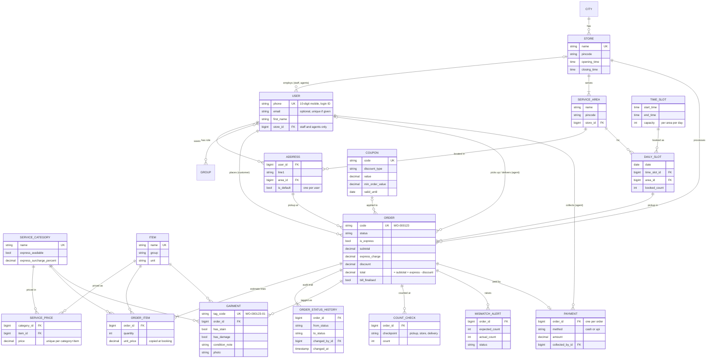

**Normalisation (3NF) in short:** every non-key column depends on the key, the whole key and nothing but the key.
- Prices live in `SERVICE_PRICE`, because a price depends on (category, item) together, not on either one alone.
- `SERVICE_AREA` has no city column; the city is found through its store.
- Pincode and city aren't repeated in `ADDRESS`; they come from the area.
- The only copies are **deliberate history snapshots**: `Order.address_snapshot`, and the prices in `OrderItem` and `Garment`. A bill must not change when the price list or a saved address changes later.

---

## 2. Data Flow Diagrams

### Level 0 — Context diagram

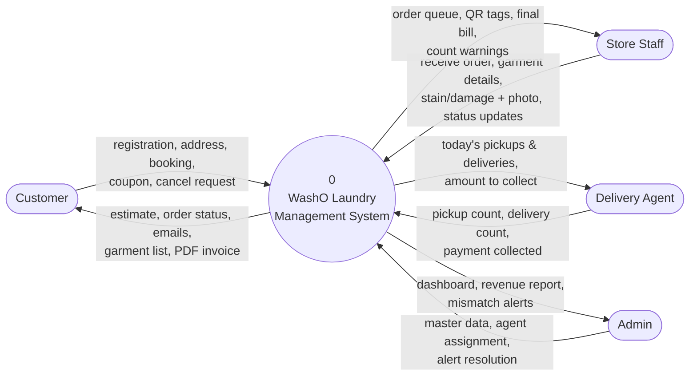

### Level 1 — Main processes

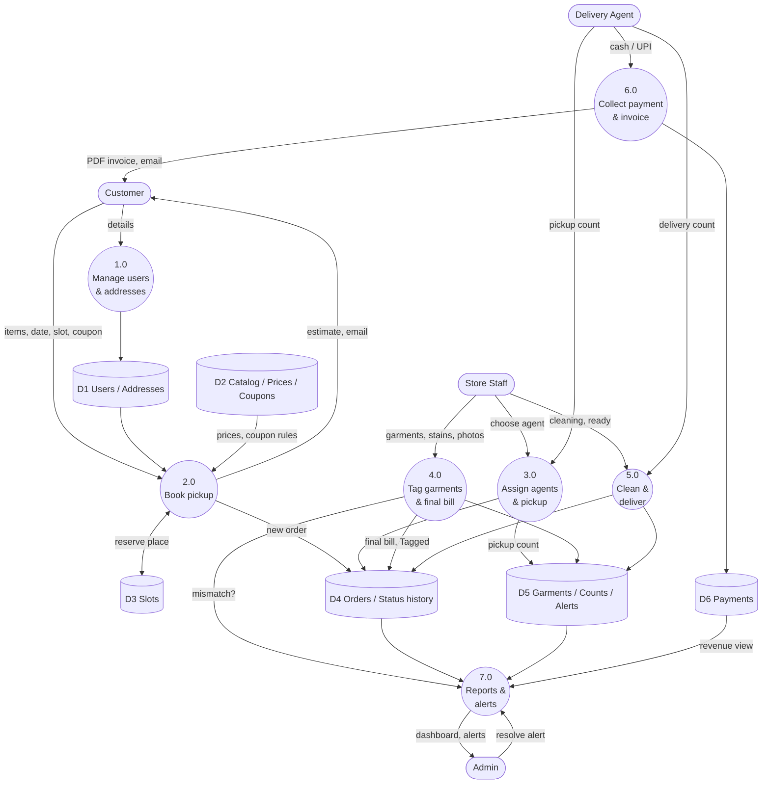

### Level 2 — Process 2.0 "Book pickup" and Process 4.0 "Tag garments"

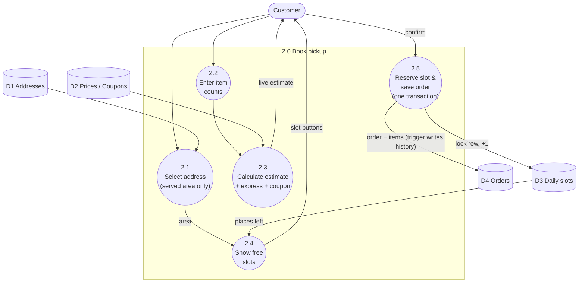

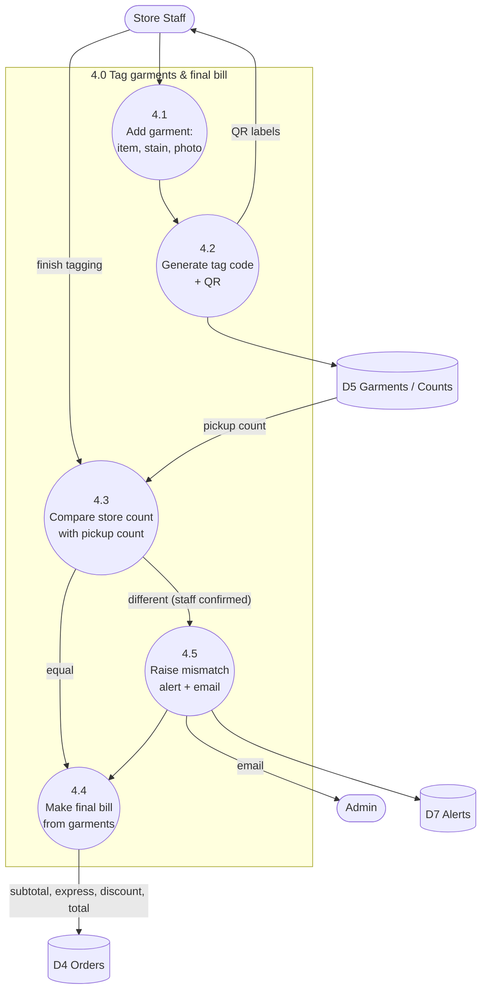

---

## 3. Use case diagram

Mermaid has no native use case diagram, so each actor is drawn on the left with its use cases grouped
inside the system boundary. **Login** is included in every use case except the public ones, and
**Admin** can also do everything Store Staff can, for all stores.

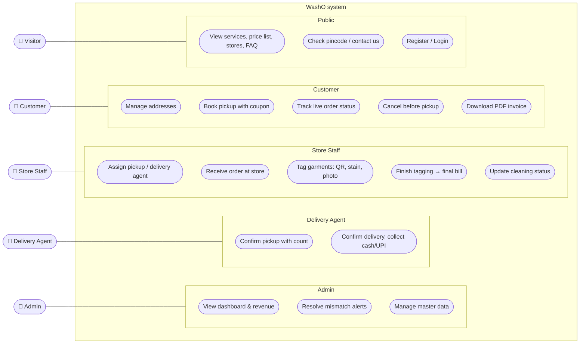
---

## 4. Class diagram

Main model classes (fields abbreviated) and the service functions that hold the business rules.

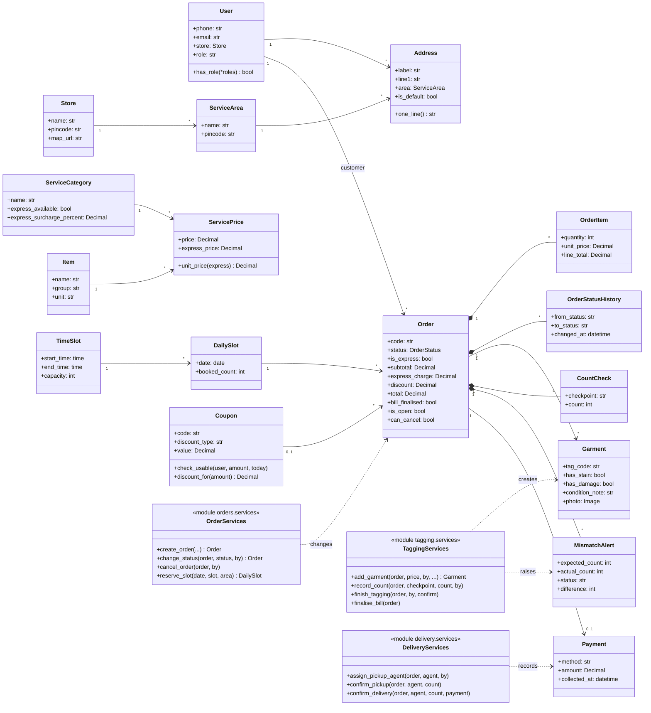

---

## 5. Sequence diagrams

### 5.1 Booking a pickup

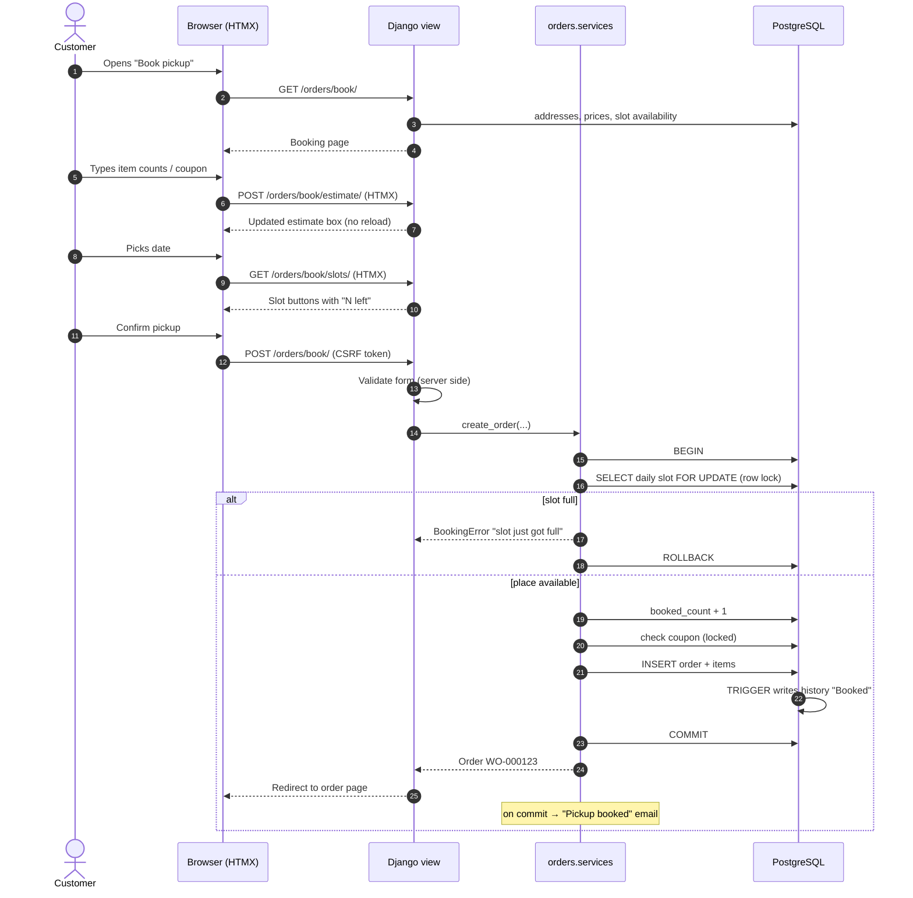

### 5.2 Garment tagging at the store

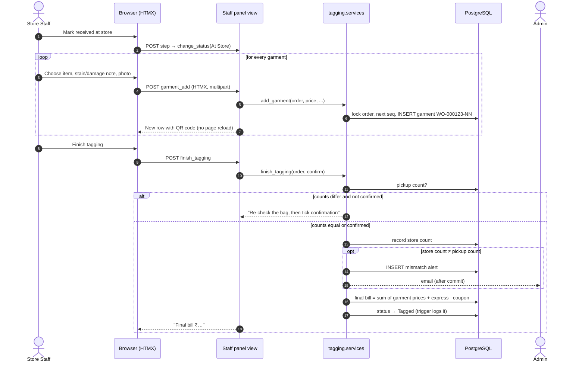

### 5.3 Delivery with Cash on Delivery

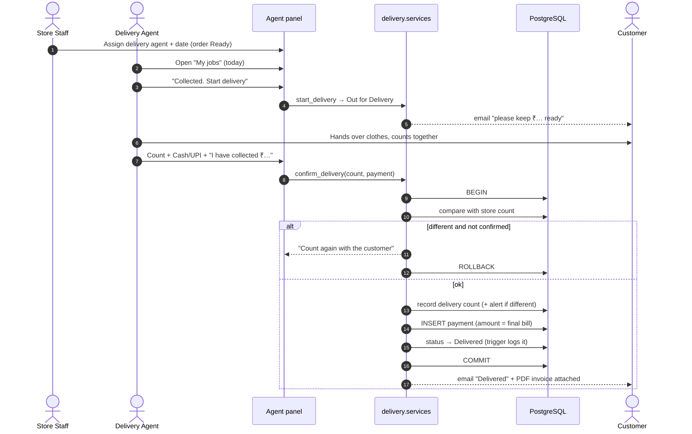

---

## 6. Activity diagram: order lifecycle

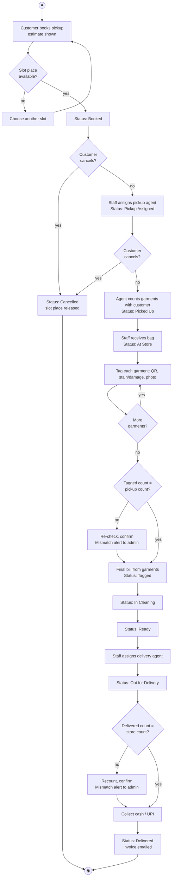

---

## 7. State diagram: order status

Exactly the transitions allowed by `ALLOWED_TRANSITIONS` in `orders/services.py`. Anything else is rejected.

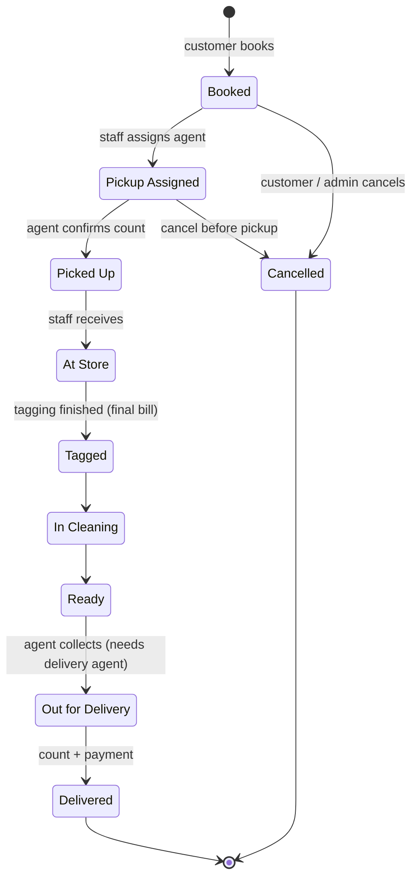

---

## 8. Deployment diagram

How the system runs on the project laptop (development). For a real launch, the same code runs behind
Gunicorn/Nginx on a Linux server; only the settings in `.env` change.

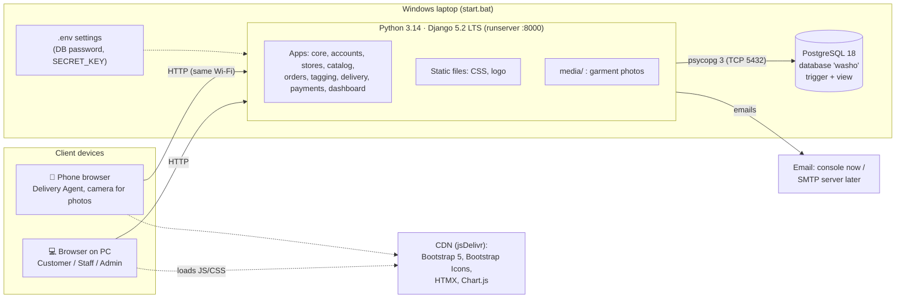
